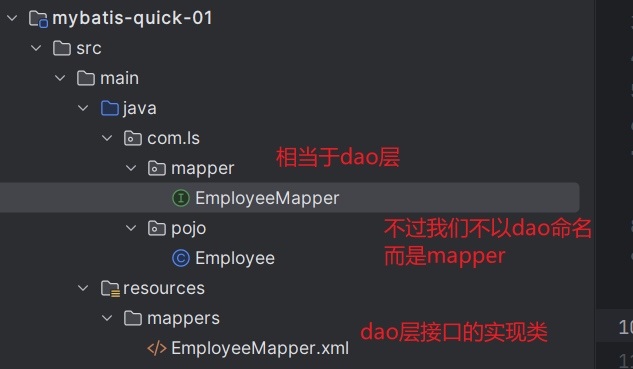
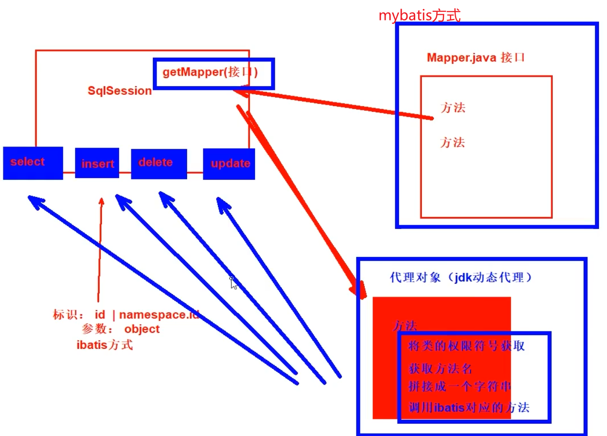

# 一 Mybatis简介

## 1.1 简介

MyBatis最初是Apache的一个开源项目iBatis, 2010年6月这个项目由Apache Software Foundation迁移到了Google Code。随着开发团队转投Google Code旗下， iBatis3.x正式更名为MyBatis。代码于2013年11月迁移到Github。

**MyBatis 是一款优秀的持久层框架，它支持自定义 SQL、存储过程以及高级映射。**MyBatis 免除了几乎所有的 JDBC 代码以及设置参数和获取结果集的工作。MyBatis 可以通过简单的 **XML** 或注解来配置和映射原始类型、接口和 Java POJO（Plain Old Java Objects，普通老式 Java 对象）为数据库中的记录。

[mybatis – MyBatis 3 | Introduction](https://mybatis.org/mybatis-3/)


## 1.2持久层框架

  - JDBC
      - SQL 夹杂在Java代码中耦合度高，导致硬编码内伤
      - 维护不易且实际开发需求中 SQL 有变化，频繁修改的情况多见
      - 代码冗长，开发效率低
  - Hibernate 和 JPA
      - 操作简便，开发效率高
      - 程序中的长难复杂 SQL 需要绕过框架
      - 内部自动生成的 SQL，不容易做特殊优化
      - 基于全映射的全自动框架，大量字段的 POJO 进行部分映射时比较困难。
      - 反射操作太多，导致数据库性能下降
  - MyBatis
      - 轻量级，性能出色
      - SQL 和 Java 编码分开，功能边界清晰。Java代码专注业务、SQL语句专注数据
      - 开发效率稍逊于 Hibernate，但是完全能够接收

  开发效率：Hibernate>Mybatis>JDBC

  运行效率：JDBC>Mybatis>Hibernate

## 1.3 快速入门

数据库

```sql
CREATE DATABASE `mybatis-example`;

USE `mybatis-example`;

CREATE TABLE `t_emp`(
  emp_id INT AUTO_INCREMENT,
  emp_name CHAR(100),
  emp_salary DOUBLE(10,5),
  PRIMARY KEY(emp_id)
);

INSERT INTO `t_emp`(emp_name,emp_salary) VALUES("tom",200.33);
INSERT INTO `t_emp`(emp_name,emp_salary) VALUES("jerry",666.66);
INSERT INTO `t_emp`(emp_name,emp_salary) VALUES("andy",777.77);
```

创建maven项目设置maven，使用自己的maven

导入依赖

```xml
<dependencies>
  <!-- mybatis依赖 -->
  <dependency>
      <groupId>org.mybatis</groupId>
      <artifactId>mybatis</artifactId>
      <version>3.5.11</version>
  </dependency>

  <!-- MySQL驱动 mybatis底层依赖jdbc驱动实现,本次不需要导入连接池,mybatis自带! -->
  <dependency>
      <groupId>mysql</groupId>
      <artifactId>mysql-connector-java</artifactId>
      <version>8.0.25</version>
  </dependency>

  <!--junit5测试-->
  <dependency>
      <groupId>org.junit.jupiter</groupId>
      <artifactId>junit-jupiter-api</artifactId>
      <version>5.3.1</version>
  </dependency>
</dependencies>
```

编写实体类

```java
package com.ls.pojo;

public class Employee {
    private  Integer empId;
    private  String empName;
    private double empSalary;

    public Integer getEmpId() {
        return empId;
    }

    public void setEmpId(Integer empId) {
        this.empId = empId;
    }

    public String getEmpName() {
        return empName;
    }

    public void setEmpName(String empName) {
        this.empName = empName;
    }

    public double getEmpSalary() {
        return empSalary;
    }

    public void setEmpSalary(double empSalary) {
        this.empSalary = empSalary;
    }

    @Override
    public String toString() {
        return "Employee{" +
                "empId=" + empId +
                ", empName='" + empName + '\'' +
                ", empSalary=" + empSalary +
                '}';
    }
}
```

编写dao层接口，不过在mybatis框架中名叫mapper接口 :包package com.ls.mapper;

```java
package com.ls.mapper;

import com.ls.pojo.Employee;

/**
 * 操作employee数据库的接口
 */
public interface EmployeeMapper {
    //根据id查询员工的信息
    Employee findById(int id);
}

```

以往就是在dao层包下新建imp实现类，但是现在使用mybatis框架，在resource/新建mappers文件夹。并在里面创建对应接口的xxx.xml文件。



编写接口的对应的xml文件。  约束在官网查看

```xml
<?xml version="1.0" encoding="UTF-8" ?>
<!DOCTYPE mapper
        PUBLIC "-//mybatis.org//DTD Mapper 3.0//EN"
        "https://mybatis.org/dtd/mybatis-3-mapper.dtd">
<!-- namespace等于mapper接口类的全限定名,这样实现对应 -->
<mapper namespace="com.ls.mapper.EmployeeMapper">

    <!-- 查询使用 select标签
            id = 方法名  绑定对应接口的方法名
            resultType = 返回值类型   方法的返回值类型
            标签内编写SQL语句          sql的参数和方法的参数一致
     -->
    <select id="findById" resultType="com.ls.pojo.Employee">
        <!-- #{empId}代表动态传入的参数,并且进行赋值!后面详细讲解 -->
        select emp_id empId,emp_name empName, emp_salary empSalary from
        t_emp where emp_id = #{empId}
    </select>
</mapper>
```


编写mybatis配置文件 约束在官网查看

mybatis框架配置文件： 数据库连接信息，性能配置，mapper.xml配置等！

习惯上命名为 mybatis-config.xml，这个文件名仅仅只是建议，并非强制要求。将来整合 Spring 之后，这个配置文件可以省略，所以大家操作时可以直接复制、粘贴。

```xml
<?xml version="1.0" encoding="UTF-8" ?>
<!DOCTYPE configuration
  PUBLIC "-//mybatis.org//DTD Config 3.0//EN"
  "http://mybatis.org/dtd/mybatis-3-config.dtd">
<configuration>

  <!-- environments表示配置Mybatis的开发环境，可以配置多个环境，在众多具体环境中，使用default属性指定实际运行时使用的环境。default属性的取值是environment标签的id属性的值。 -->
  <environments default="development">
    <!-- environment表示配置Mybatis的一个具体的环境 -->
    <environment id="development">
      <!-- Mybatis的内置的事务管理器 -->
      <transactionManager type="JDBC"/>
      <!-- 配置数据源 -->
      <dataSource type="POOLED">
        <!-- 建立数据库连接的具体信息 -->
        <property name="driver" value="com.mysql.cj.jdbc.Driver"/>
        <property name="url" value="jdbc:mysql://localhost:3306/mybatis-example"/>
        <property name="username" value="root"/>
        <property name="password" value="root"/>
      </dataSource>
    </environment>
  </environments>

  <mappers>
    <!-- Mapper注册：指定Mybatis映射文件的具体位置 -->
    <!-- mapper标签：配置一个具体的Mapper映射文件 -->
    <!-- resource属性：指定Mapper映射文件的实际存储位置，这里需要使用一个以类路径根目录为基准的相对路径 -->
    <!--    对Maven工程的目录结构来说，resources目录下的内容会直接放入类路径，所以这里我们可以以resources目录为基准 -->
    <mapper resource="mappers/EmployeeMapper.xml"/>
  </mappers>

</configuration>
```

测试

```java
import com.ls.mapper.EmployeeMapper;
import com.ls.pojo.Employee;
import org.apache.ibatis.io.Resources;
import org.apache.ibatis.session.SqlSession;
import org.apache.ibatis.session.SqlSessionFactory;
import org.apache.ibatis.session.SqlSessionFactoryBuilder;
import org.junit.jupiter.api.Test;

import java.io.IOException;
import java.io.InputStream;

public class mybatisQuickTest {

    @Test
    public  void test() throws IOException {
        // 1. 根据mybatis.xml创建SqlSessionFactory 对象
        //以输入流的方式加载mybatis配置文件
        InputStream resourceAsStream = Resources.getResourceAsStream("mybatis-config.xml");
        //根据配置文件创建SqlSessionFactory
        SqlSessionFactory sessionFactory = new SqlSessionFactoryBuilder().build(resourceAsStream);

        // 2 .根据SqlSessionFactory 对象开启一个会话
        SqlSession sqlSession = sessionFactory.openSession();

        //3. 根据接口的class对象获取接口类型的对象（动态代理）
        EmployeeMapper employeeMapper = sqlSession.getMapper(EmployeeMapper.class);

        //4.使用代理类，调用方法
        Employee employee = employeeMapper.findById(1);
        System.out.println("employee = " + employee);

        //5. 关闭Sqlsession
        sqlSession.commit(); //提交事务，查询不需要，其他操作需要
        sqlSession.close(); //关闭会话
       
        return 0;
    }
}
```

说明：

- SqlSession：代表Java程序和数据库之间的会话。（HttpSession是Java程序和浏览器之间的会话）
- SqlSessionFactory：是“生产”SqlSession的“工厂”。
- 工厂模式：如果创建某一个对象，使用的过程基本固定，那么我们就可以把创建这个对象的相关代码封装到一个“工厂类”中，以后都使用这个工厂类来“生产”我们需要的对象。

# 二 ibatis简介

## 2.1 简介

ibatis 1.x  ibatis 2.x ——> myabtis 3.x

名字发生了改变，主要是因为用法发生了改变。mybatis 3.x 是对ibatis1.x,2.x的封装以及优化。

导入mybatis3.x的包，依然有ibatis的包，就是mybatis 3.x 是对ibatis1.x,2.x的封装以及优化。


## 2.2 ibatis使用

数据库

```sql
create table students(
	sid int primary key,
	sname vachar(20)
)
```

实体类

```java
package com.ls.pojo;

/**
 * ibatis 使用演示实体类
 */
public class Student {
    private  Integer sid;
    private  String sname;

    public Integer getSid() {
        return sid;
    }

    public void setSid(Integer sid) {
        this.sid = sid;
    }

    public String getSname() {
        return sname;
    }

    public void setSname(String sname) {
        this.sname = sname;
    }

    @Override
    public String toString() {
        return "Student{" +
                "sid=" + sid +
                ", sname='" + sname + '\'' +
                '}';
    }
}

```

不需要mapper接口，直接写mapper.xml文件

```xml
<?xml version="1.0" encoding="UTF-8" ?>
<!DOCTYPE mapper
        PUBLIC "-//mybatis.org//DTD Mapper 3.0//EN"
        "https://mybatis.org/dtd/mybatis-3-mapper.dtd">
<!--
    ibatis方式对数据库crud
    1. 不要求写接口
    2. 直接创建mapper.xml ，编写sql
            namespace="xxx" 没有要求。仅作为后续寻找sql语句的标识

    3. 内部通过crud标签声明sql
            select update  delete insert
            id  无任何要求，仅作为后续寻找sql语句的标识
            resultType 返回结果的全限定符
            
-->
<mapper namespace="aa">
    <select id="bbb" resultType="com.ls.pojo.Student">
        select * from students where sid = #{id}
    </select>

</mapper>
```

配置文件

```xml
<?xml version="1.0" encoding="UTF-8" ?>
<!DOCTYPE configuration
        PUBLIC "-//mybatis.org//DTD Config 3.0//EN"
        "http://mybatis.org/dtd/mybatis-3-config.dtd">
<configuration>

    <!-- environments表示配置Mybatis的开发环境，可以配置多个环境，在众多具体环境中，使用default属性指定实际运行时使用的环境。default属性的取值是environment标签的id属性的值。 -->
    <environments default="development">
        <!-- environment表示配置Mybatis的一个具体的环境 -->
        <environment id="development">
            <!-- Mybatis的内置的事务管理器 -->
            <transactionManager type="JDBC"/>
            <!-- 配置数据源 -->
            <dataSource type="POOLED">
                <!-- 建立数据库连接的具体信息 -->
                <property name="driver" value="com.mysql.cj.jdbc.Driver"/>
                <property name="url" value="jdbc:mysql://localhost:3306/mybatis-example"/>
                <property name="username" value="root"/>
                <property name="password" value="root"/>
            </dataSource>
        </environment>
    </environments>

    <mappers>
        <!-- Mapper注册：指定Mybatis映射文件的具体位置 -->
        <!-- mapper标签：配置一个具体的Mapper映射文件 -->
        <!-- resource属性：指定Mapper映射文件的实际存储位置，这里需要使用一个以类路径根目录为基准的相对路径 -->
        <!--    对Maven工程的目录结构来说，resources目录下的内容会直接放入类路径，所以这里我们可以以resources目录为基准 -->
    
        <mapper resource="mappers/Student.xml"/>
    </mappers>

</configuration>
```

测试

```java
    @Test
    public  void test2() throws IOException {

        //1.获取配置文件并根据配置文件创建SqlSessionFactory 对象
        InputStream inputStream = Resources.getResourceAsStream("mybatis-config.xml");
        SqlSessionFactory sqlSessionFactory = new SqlSessionFactoryBuilder().build(inputStream);
        //2. 通过工程 打开会话
        SqlSession sqlSession = sqlSessionFactory.openSession();

        //3. 调用sqlSession的方法对数据库操作
        // select delete update insert
        //都是两个参数，第一个参数字符串，第二个参数object
        // 第一个参数填写sql语句的位置 namespace.id,
        // 第二个参数写sql的参数,如果sql有多个参数还要封装比较麻烦（mybatis的优化）
        // 返回值是object类，需要强制转化

         Student student = sqlSession.selectOne("aa.bbb", 1);
        System.out.println("student = " + student);

        //缺点： 1.参数串一个字符串,表示sql语句的位置，容易写错
        //      2.只能传一个参数，如果有多个参数还要封装。
        //      3.返回值问题，返回的是Object类，还要强转。

        //事务
        sqlSession.commit();
        sqlSession.close();
    }
```

**总结**

ibatis不用创捷接口，而是直接创建mapper.xml文件。通过namespace和id表示sql语句的位置。

获取sqlsession后，并不向mybatis那样根据接口获得代理，在用代理的方法。而是调用sqlsesion方法如select，update，insert，delete方法对数据库操作。

对于这些方法来说都有两个参数一个是sql的位置，一个是object。当sql有多个数据的时候，还要封装成一个对象传入object.

总体来说ibatis的缺点：1. 调用sqlsession方法只能传一个参数

​										2.返回值是object类还要自己强制转换。


# 三 mybatis原理




mybatis的底层还是ibatis。

mybatis的getMapper(接口)会使用jdk动态代理实现代理类。通过代理类，获取namespace.id即sql语句的位置和参数，将sql语句以及参数拼接调用sqlsession方法。这也要求了mapper接口不能重载，不然id就相同了，有多个id不知道使用哪一个。