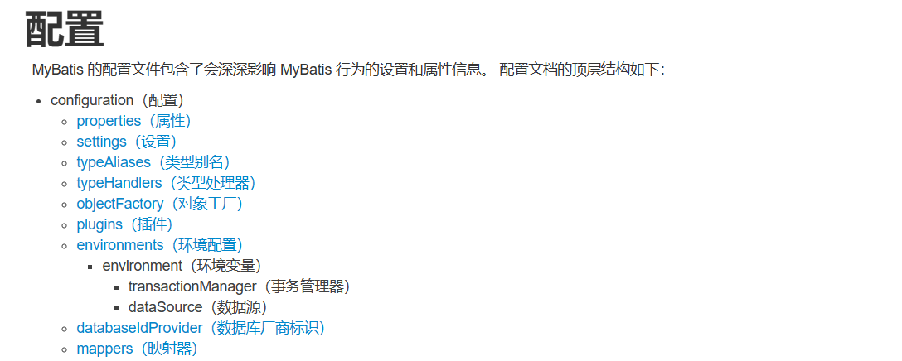
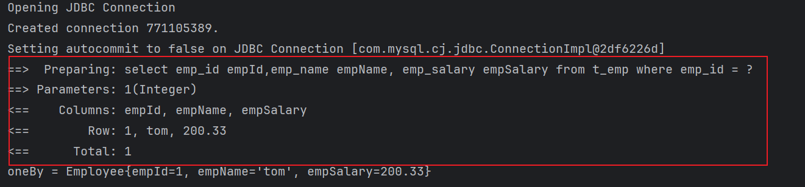
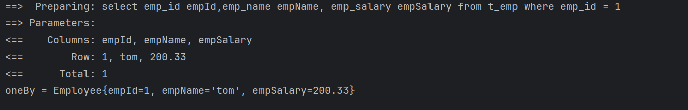

#  mybatis基本使用

# 一 向sql语句传参 
## 1.1 **mybatis日志输出配置**

mybatis配置文件设计标签和顶层结构如下：

    
我们可以在mybatis的配置文件使用**settings标签**设置，输出运过程SQL日志！通过查看日志，我们可以判定#{} 和 ${}的输出效果！

## 1.2 **#{}形式**
* Mybatis会将SQL语句中的#{}转换为问号占位符，然后在赋值。
* #{}   占位符 + 赋值
            如下 emp_id = #{id}  ------->过程为先用？占位 emp_id = ?  ---------->  然后用参数赋值给 emp_id = param

```xml
<mapper namespace="com.ls.mapper.EmployeeMapper">
    <select id="findOneBy" resultType="com.ls.pojo.Employee">
        select emp_id empId,emp_name empName, emp_salary empSalary from
        t_emp where emp_id = #{empId}
    </select>
</mapper>
```

测试输出结果



## 1.3 **${}形式**

* ${}形式传参，底层Mybatis做的是字符串拼接操作。
   ${}  拼接字符串	如 emp_id = ${id}  过程为  "emp_id =" + "id"


```xml
<select id="findOneBy" resultType="com.ls.pojo.Employee">
        select emp_id empId,emp_name empName, emp_salary empSalary from
        t_emp where emp_id = ${empId}
    </select>
```

测试输出



通常不会采用${}的方式传值。一个特定的适用场景是：通过Java程序动态生成数据库表，表名部分需要Java程序通过参数传入；而JDBC对于表名部分是不能使用问号占位符的，此时只能使用

结论：实际开发中，能用#{}实现的，肯定不用${}。

特殊情况： 动态的不是值，是列名或者关键字，需要使用${}拼接

所以综上所述，当参数是值是应该用#{}，当参数不是值而是数据库的关键字时应用${}。

# 二 输入参数场景

这里数据输入具体是指上层方法（例如Service方法）调用Mapper接口时，数据传入的形式。

- 简单类型：只包含一个值的数据类型
    - 基本数据类型：int、byte、short、double、……
    - 基本数据类型的包装类型：Integer、Character、Double、……
    - 字符串类型：String
- 复杂类型：包含多个值的数据类型
    - 实体类类型：Employee、Department、……
    - 集合类型：List、Set、Map、……
    - 数组类型：int[]、String[]、……
    - 复合类型：List<Employee>、实体类中包含集合……


## 2.1 单个简单值输入

* 
   单个简单类型输入。 #{key} 随便命名，但是推荐以接口的参数名


mapper接口

```java
//根据id删除员工信息
int deleteById(Integer id);
```

mapper.xml文件


```xml
  <delete id="deleteById">
        delete from t_emp where emp_id = #{hhhh}
    </delete>
```


## 2.2 单个实体类型

*  单个实体对象输入。 #{key} key以对象的属性名命名。

mapper接口

```java
 //新增员工信息
    int insertEmployee(Employee employee);
```

mapper.xml

```xml
  <insert id="insertEmployee">
        insert into t_emp (emp_id,emp_name,emp_salary) values(#{empId},#{empName},#{empSalary})
    </insert>
```

**Mybatis会根据#{}中传入的数据，加工成getXxx()方法，通过反射在实体类对象中调用这个方法，从而获取到对应的数据。填充到#{}解析后的问号占位符这个位置。**

## 2.3 多个简单值输入

* 多个简单值传入，不可以按照接口的参数名获取
* 可以在接口参数上使用@Param注解， key的值取注解的值。 key = @Param("value")
* 可以使用mybatis默认机制
  * arg0，arg1，...argn, 形参依次从左到右对应arg0，arg1.....argn
  * param1，param2   形参依次从左盗用对应param1，param2

## 2.4 **Map类型参数**

  Mapper接口中抽象方法的声明

```Java
int updateEmployeeByMap(Map<String, Object> paramMap);
```

  SQL语句

```XML
<update id="updateEmployeeByMap">

  update t_emp set emp_salary=#{empSalaryKey} where emp_id=#{empIdKey}

</update>
```

  **对应关系**

  #{}中写Map中的key

  **使用场景**

  有很多零散的参数需要传递，但是没有对应的实体类类型可以使用。使用@Param注解一个一个传入又太麻烦了。所以都封装到Map中。


# 三 数据输出

数据输出总体上有两种形式：

- 增删改操作返回的受影响行数：直接使用 int 或 long 类型接收即可
- 查询操作的查询结果

我们需要做的是，指定查询的输出数据类型即可！

## 3.1 单个简单类型

Mapper接口中的抽象方法

```Java
int selectEmpCount();
```

SQL语句

```XML
<select id="selectEmpCount" resultType="int">
  select count(*) from t_emp
</select>
```

> Mybatis 内部给常用的数据类型设定了很多别名。 以 int 类型为例，可以写的名称有：int、integer、Integer、java.lang.Integer、Int、INT、INTEGER 等等。

**细节解释：**

  select标签，通过resultType指定查询返回值类型！

  resultType = "全限定符 ｜ 别名 ｜ 如果是返回集合类型，写范型类型即可"

别名问题：

  [https://mybatis.org/mybatis-3/zh/configuration.html#typeAliases](https://mybatis.org/mybatis-3/zh/configuration.html#typeAliases)

  类型别名可为 Java 类型设置一个缩写名字。 它仅用于 XML 配置，意在降低冗余的全限定类名书写。例如：

```XML
<typeAliases>
  <typeAlias alias="Author" type="domain.blog.Author"/>
  <typeAlias alias="Blog" type="domain.blog.Blog"/>
</typeAliases>
```

  当这样配置时，`Blog` 可以用在任何使用 `domain.blog.Blog` 的地方。

  也可以指定一个包名，MyBatis 会在包名下面搜索需要的 Java Bean，比如：

```XML
<typeAliases> <package name="domain.blog"/> </typeAliases>
```

  每一个在包 `domain.blog` 中的 Java Bean，在没有注解的情况下，会使用 Bean 的首字母小写的非限定类名来作为它的别名。 比如 `domain.blog.Author` 的别名为 `author`；若有注解，则别名为其注解值。见下面的例子：

```Java
@Alias("author")
public class Author {
    ...
}
```

  下面是Mybatis为常见的 Java 类型内建的类型别名。它们都是不区分大小写的，注意，为了应对原始类型的命名重复，采取了特殊的命名风格。

| 别名                      | 映射的类型 |
| ------------------------- | ---------- |
| _byte                     | byte       |
| _char (since 3.5.10)      | char       |
| _character (since 3.5.10) | char       |
| _long                     | long       |
| _short                    | short      |
| _int                      | int        |
| _integer                  | int        |
| _double                   | double     |
| _float                    | float      |
| _boolean                  | boolean    |
| string                    | String     |
| byte                      | Byte       |
| char (since 3.5.10)       | Character  |
| character (since 3.5.10)  | Character  |
| long                      | Long       |
| short                     | Short      |
| int                       | Integer    |
| integer                   | Integer    |
| double                    | Double     |
| float                     | Float      |
| boolean                   | Boolean    |
| date                      | Date       |
| decimal                   | BigDecimal |
| bigdecimal                | BigDecimal |
| biginteger                | BigInteger |
| object                    | Object     |
| object[]                  | Object[]   |
| map                       | Map        |
| hashmap                   | HashMap    |
| list                      | List       |
| arraylist                 | ArrayList  |
| collection                | Collection |

## 3.2 单个实体类型

Mapper接口的抽象方法

```Java
Employee selectEmployee(Integer empId);
```

SQL语句

```XML
<!-- 编写具体的SQL语句，使用id属性唯一的标记一条SQL语句 -->
<!-- resultType属性：指定封装查询结果的Java实体类的全类名 -->
<select id="selectEmployee" resultType="com.atguigu.mybatis.entity.Employee">

  <!-- Mybatis负责把SQL语句中的#{}部分替换成“?”占位符 -->
  <!-- 给每一个字段设置一个别名，让别名和Java实体类中属性名一致 -->
  select emp_id empId,emp_name empName,emp_salary empSalary from t_emp where emp_id=#{maomi}

</select>
```

通过给数据库表字段加别名，让查询结果的每一列都和Java实体类中属性对应起来。

增加全局配置自动识别对应关系

在 Mybatis 全局配置文件中，做了下面的配置，select语句中可以不给字段设置别名

```XML
<!-- 在全局范围内对Mybatis进行配置 -->
<settings>

  <!-- 具体配置 -->
  <!-- 从org.apache.ibatis.session.Configuration类中可以查看能使用的配置项 -->
  <!-- 将mapUnderscoreToCamelCase属性配置为true，表示开启自动映射驼峰式命名规则 -->
  <!-- 规则要求数据库表字段命名方式：单词_单词 -->
  <!-- 规则要求Java实体类属性名命名方式：首字母小写的驼峰式命名 -->
  <setting name="mapUnderscoreToCamelCase" value="true"/>
</settings>
```

## 3.3返回map类型

适用于SQL查询返回的各个字段综合起来并不和任何一个现有的实体类对应，没法封装到实体类对象中。能够封装成实体类类型的，就不使用Map类型。

Mapper接口的抽象方法

```Java
Map<String,Object> selectEmpNameAndMaxSalary();
```

SQL语句

```XML
<!-- Map<String,Object> selectEmpNameAndMaxSalary(); -->
<!-- 返回工资最高的员工的姓名和他的工资 -->
<select id="selectEmpNameAndMaxSalary" resultType="map">
  SELECT
    emp_name 员工姓名,
    emp_salary 员工工资,
    (SELECT AVG(emp_salary) FROM t_emp) 部门平均工资
  FROM t_emp WHERE emp_salary=(
    SELECT MAX(emp_salary) FROM t_emp
  )
</select>
```

junit测试

```java
@Test
public void testQueryEmpNameAndSalary() {

  EmployeeMapper employeeMapper = session.getMapper(EmployeeMapper.class);

  Map<String, Object> resultMap = employeeMapper.selectEmpNameAndMaxSalary();

  Set<Map.Entry<String, Object>> entrySet = resultMap.entrySet();

  for (Map.Entry<String, Object> entry : entrySet) {

    String key = entry.getKey();

    Object value = entry.getValue();

    log.info(key + "=" + value);

  }
}
```

## 3.4 返回list集合

resultType = list的泛型。

查询结果返回多个实体类对象，希望把多个实体类对象放在List集合中返回。此时不需要任何特殊处理，在resultType属性中还是设置实体类类型即可。

Mapper接口中抽象方法

```Java
List<Employee> selectAll();
```

SQL语句

```XML
<!-- List<Employee> selectAll(); -->
<select id="selectAll" resultType="com.atguigu.mybatis.entity.Employee">
  select emp_id empId,emp_name empName,emp_salary empSalary
  from t_emp
</select>
```

## 3.5 获得自增长主键

Mapper接口中的抽象方法

```Java
int insertEmployee(Employee employee);
```
SQL语句

```XML
<!-- int insertEmployee(Employee employee); -->
<!-- useGeneratedKeys属性字面意思就是“使用生成的主键” -->
<!-- keyProperty属性可以指定主键在实体类对象中对应的属性名，Mybatis会将拿到的主键值存入这个属性 -->
<insert id="insertEmployee" useGeneratedKeys="true" keyProperty="empId">
  insert into t_emp(emp_name,emp_salary)
  values(#{empName},#{empSalary})
</insert>
```
注意
	Mybatis是将自增主键的值设置到实体类对象中，而不是以Mapper接口方法返回值的形式返回。

## 3.6 非自增长主键

而对于不支持自增型主键的数据库（例如 Oracle）或者字符串类型主键，则可以使用 selectKey 子元素：selectKey 元素将会首先运行，id 会被设置，然后插入语句会被调用！

使用 `selectKey` 帮助插入UUID作为字符串类型主键示例：

```XML
<insert id="insertUser" parameterType="User">
    <selectKey keyProperty="id" resultType="java.lang.String"
        order="BEFORE">
        SELECT UUID() as id
    </selectKey>
    INSERT INTO user (id, username, password) 
    VALUES (
        #{id},
        #{username},
        #{password}
    )
</insert>

```

在上例中，我们定义了一个 `insertUser` 的插入语句来将 `User` 对象插入到 `user` 表中。我们使用 `selectKey` 来查询 UUID 并设置到 `id` 字段中。

通过 `keyProperty` 属性来指定查询到的 UUID 赋值给对象中的 `id` 属性，而 `resultType` 属性指定了 UUID 的类型为 `java.lang.String`。

需要注意的是，我们将 `selectKey` 放在了插入语句的前面，这是因为 MySQL 在 `insert` 语句中只支持一个 `select` 子句，而 `selectKey` 中查询 UUID 的语句就是一个 `select` 子句，因此我们需要将其放在前面。

最后，在将 `User` 对象插入到 `user` 表中时，我们直接使用对象中的 `id` 属性来插入主键值。

使用这种方式，我们可以方便地插入 UUID 作为字符串类型主键。当然，还有其他插入方式可以使用，如使用Java代码生成UUID并在类中显式设置值等。需要根据具体应用场景和需求选择合适的插入方式。

## 3.7ResultMap自定义映射

1. 别名对应

    将字段的别名设置成和实体类属性一致。

```XML
<!-- 编写具体的SQL语句，使用id属性唯一的标记一条SQL语句 -->
<!-- resultType属性：指定封装查询结果的Java实体类的全类名 -->
<select id="selectEmployee" resultType="com.atguigu.mybatis.entity.Employee">

  <!-- Mybatis负责把SQL语句中的#{}部分替换成“?”占位符 -->
  <!-- 给每一个字段设置一个别名，让别名和Java实体类中属性名一致 -->
  select emp_id empId,emp_name empName,emp_salary empSalary from t_emp where emp_id=#{maomi}

</select>
```
 关于实体类属性的约定：
getXxx()方法、setXxx()方法把方法名中的get或set去掉，首字母小写。

2. 全局配置自动识别驼峰式命名规则

    在Mybatis全局配置文件加入如下配置：

```XML
<!-- 使用settings对Mybatis全局进行设置 -->
<settings>

  <!-- 将xxx_xxx这样的列名自动映射到xxXxx这样驼峰式命名的属性名 -->
  <setting name="mapUnderscoreToCamelCase" value="true"/>

</settings>
```
SQL语句中可以不使用别名

```XML
<!-- Employee selectEmployee(Integer empId); -->
<select id="selectEmployee" resultType="com.atguigu.mybatis.entity.Employee">

  select emp_id,emp_name,emp_salary from t_emp where emp_id=#{empId}

</select>
```
3. 使用resultMap

    使用resultMap标签定义对应关系，再在后面的SQL语句中引用这个对应关系

```XML
<!-- 专门声明一个resultMap设定column到property之间的对应关系 -->
<resultMap id="selectEmployeeByRMResultMap" type="com.atguigu.mybatis.entity.Employee">

  <!-- 使用id标签设置主键列和主键属性之间的对应关系 -->
  <!-- column属性用于指定字段名；property属性用于指定Java实体类属性名 -->
  <id column="emp_id" property="empId"/>

  <!-- 使用result标签设置普通字段和Java实体类属性之间的关系 -->
  <result column="emp_name" property="empName"/>

  <result column="emp_salary" property="empSalary"/>

</resultMap>

<!-- Employee selectEmployeeByRM(Integer empId); -->
<select id="selectEmployeeByRM" resultMap="selectEmployeeByRMResultMap">

  select emp_id,emp_name,emp_salary from t_emp where emp_id=#{empId}

</select>
```